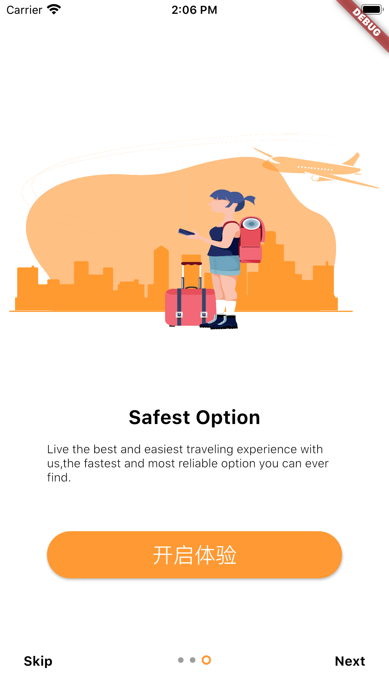
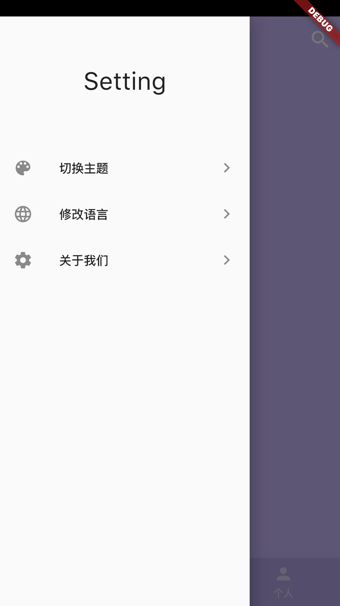
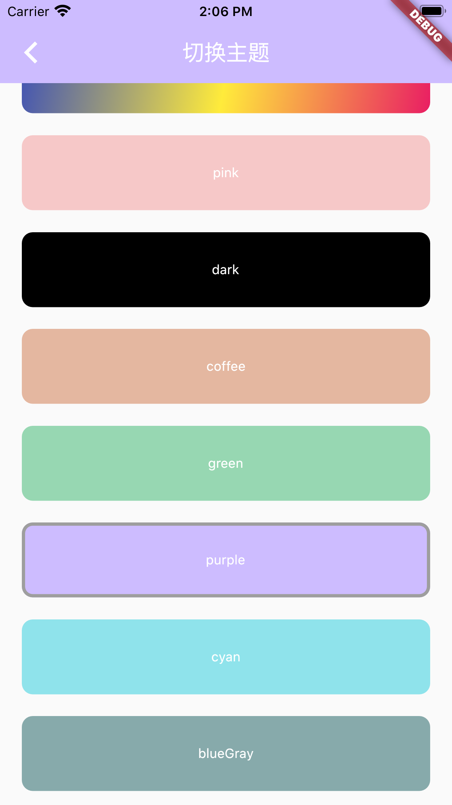
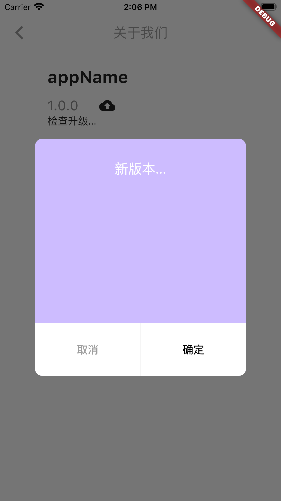

# 基于flutter 构建的app开发入门程序
# 支持 语言包, 主题, 升级程序等

国际化支持:./intl.sh 设置执行权限 
1:在 IntlLocalizations 里面增加要添加的内容
2:执行./intl.sh文件. 会在i10n-arb文件夹下面生成 intl_messages.arb
3:将intl_messages.arb 里面内容复制到 需要的语言包里面进行翻译 . 比如intl_cn.arb
4:翻译完成以后. 再次执行./intl.sh . 会在lib/i10n下面生产message_语言.dart 文件, 就可以直接使用了

## Screenshot

Basic text carousel demo:

